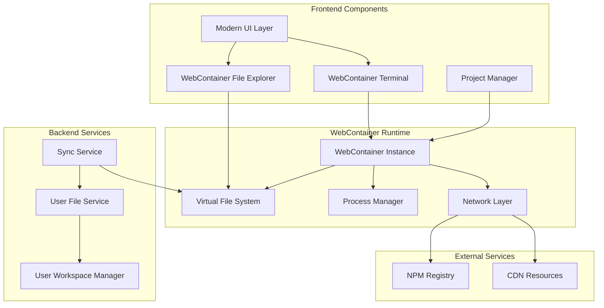

# Design Document

## Overview

This design outlines the replacement of the current terminal and file system components with WebContainer-based implementations. The solution provides a universal in-browser development environment that works with any project type while offering enhanced functionality through WebContainer's browser-based runtime. The design emphasizes modern UI components, seamless integration, and intelligent project detection.

## Architecture

### High-Level Architecture



### Component Relationships

The architecture follows a layered approach where:

- **UI Layer**: Modern React components with enhanced styling
- **WebContainer Layer**: Browser-based runtime environment
- **Sync Layer**: Bidirectional synchronization between WebContainer and backend
- **Backend Layer**: Existing file and workspace management services

## Components and Interfaces

### 1. WebContainer Terminal Component

**Purpose**: Replace the current WebSocket-based terminal with a WebContainer-powered terminal.

**Key Features**:

- Full Linux-like environment in the browser
- Native command execution without WebSocket overhead
- Built-in package managers (npm, yarn, pnpm)
- Process management and job control
- Modern terminal UI with themes and customization

**Interface**:

```typescript
interface WebContainerTerminal {
  // Core terminal functionality
  executeCommand(command: string): Promise<ProcessResult>;
  attachToProcess(pid: number): void;
  killProcess(pid: number): void;

  // Project detection and smart commands
  detectProjectType(): ProjectType;
  getSmartCommands(): SmartCommand[];

  // UI and theming
  setTheme(theme: TerminalTheme): void;
  resize(cols: number, rows: number): void;
}

interface ProcessResult {
  stdout: string;
  stderr: string;
  exitCode: number;
  pid: number;
}

interface SmartCommand {
  name: string;
  description: string;
  command: string;
  condition: (projectType: ProjectType) => boolean;
}
```

### 2. WebContainer File Explorer Component

**Purpose**: Replace the current file explorer with a WebContainer-integrated file system browser.

**Key Features**:

- Real-time file system operations
- Modern tree view with icons and styling
- Drag-and-drop file operations
- Context menus and keyboard shortcuts
- File type detection and syntax highlighting

**Interface**:

```typescript
interface WebContainerFileExplorer {
  // File operations
  createFile(path: string, content?: string): Promise<void>;
  createFolder(path: string): Promise<void>;
  deleteFile(path: string): Promise<void>;
  renameFile(oldPath: string, newPath: string): Promise<void>;

  // File system watching
  watchFileSystem(): Observable<FileSystemEvent>;

  // UI operations
  expandFolder(path: string): void;
  selectFile(path: string): void;
  refreshTree(): void;
}

interface FileSystemEvent {
  type: "create" | "delete" | "modify" | "rename";
  path: string;
  oldPath?: string;
}
```

### 3. Project Detection Service

**Purpose**: Automatically detect project types and provide framework-specific tooling.

**Key Features**:

- Package.json analysis
- Framework detection (Vite, Next.js, React, etc.)
- Smart command suggestions
- Development server management

**Interface**:

```typescript
interface ProjectDetectionService {
  detectProjectType(fileSystem: WebContainerFileSystem): Promise<ProjectInfo>;
  getFrameworkCommands(projectType: ProjectType): SmartCommand[];
  suggestActions(projectType: ProjectType): ActionSuggestion[];
}

interface ProjectInfo {
  type: ProjectType;
  framework: string;
  version?: string;
  packageManager: "npm" | "yarn" | "pnpm";
  scripts: Record<string, string>;
  dependencies: Record<string, string>;
}

type ProjectType =
  | "vite"
  | "nextjs"
  | "react"
  | "nodejs"
  | "static"
  | "unknown";
```

### 4. Synchronization Service

**Purpose**: Keep WebContainer file system synchronized with backend storage.

**Key Features**:

- Bidirectional file synchronization
- Conflict resolution
- Offline support with sync queuing
- Performance optimization with debouncing

**Interface**:

```typescript
interface SynchronizationService {
  // Sync operations
  syncToBackend(path: string): Promise<void>;
  syncFromBackend(path: string): Promise<void>;
  syncAll(): Promise<SyncResult>;

  // Conflict resolution
  resolveConflict(conflict: SyncConflict): Promise<void>;

  // Status monitoring
  getSyncStatus(): SyncStatus;
  onSyncStatusChange(callback: (status: SyncStatus) => void): void;
}

interface SyncResult {
  synced: string[];
  conflicts: SyncConflict[];
  errors: SyncError[];
}
```

### 5. Preview Management Service

**Purpose**: Handle development server detection and preview integration.

**Key Features**:

- Automatic port detection
- Preview URL generation
- Hot reload support
- Multiple server management

**Interface**:

```typescript
interface PreviewService {
  // Server management
  startDevServer(projectType: ProjectType): Promise<ServerInfo>;
  stopDevServer(port: number): Promise<void>;
  getRunningServers(): ServerInfo[];

  // Preview integration
  getPreviewUrl(port: number): string;
  onServerReady(callback: (server: ServerInfo) => void): void;
}

interface ServerInfo {
  port: number;
  url: string;
  projectType: ProjectType;
  status: "starting" | "ready" | "error";
  pid: number;
}
```

## Data Models

### WebContainer State

```typescript
interface WebContainerState {
  // Container status
  isInitialized: boolean;
  isReady: boolean;
  error?: string;

  // File system
  fileSystem: WebContainerFileSystem;
  workingDirectory: string;

  // Processes
  runningProcesses: ProcessInfo[];

  // Project information
  projectInfo?: ProjectInfo;

  // Sync status
  syncStatus: SyncStatus;
}

interface ProcessInfo {
  pid: number;
  command: string;
  status: "running" | "stopped" | "error";
  startTime: Date;
  port?: number;
}
```

### File System Models

```typescript
interface FileSystemNode {
  path: string;
  name: string;
  type: "file" | "directory";
  size?: number;
  modified?: Date;
  children?: FileSystemNode[];
}

interface FileContent {
  path: string;
  content: string;
  encoding: "utf8" | "binary";
  modified: Date;
}
```

### UI State Models

```typescript
interface TerminalState {
  // Terminal configuration
  theme: TerminalTheme;
  fontSize: number;
  fontFamily: string;

  // Session state
  history: string[];
  workingDirectory: string;

  // UI state
  isVisible: boolean;
  height: number;
}

interface FileExplorerState {
  // Tree state
  expandedFolders: Set<string>;
  selectedFile?: string;

  // UI state
  isVisible: boolean;
  width: number;

  // Search and filtering
  searchTerm: string;
  filter: FileFilter;
}
```

## Error Handling

### Error Categories

1. **WebContainer Initialization Errors**

   - Container startup failures
   - Browser compatibility issues
   - Resource loading errors

2. **File System Errors**

   - Permission denied
   - File not found
   - Disk space issues

3. **Synchronization Errors**

   - Network connectivity issues
   - Conflict resolution failures
   - Backend service unavailability

4. **Process Execution Errors**
   - Command not found
   - Process crashes
   - Resource exhaustion

### Error Handling Strategy

```typescript
interface ErrorHandler {
  handleWebContainerError(error: WebContainerError): void;
  handleFileSystemError(error: FileSystemError): void;
  handleSyncError(error: SyncError): void;
  handleProcessError(error: ProcessError): void;
}

// Error recovery mechanisms
interface ErrorRecovery {
  retryWithBackoff(
    operation: () => Promise<void>,
    maxRetries: number
  ): Promise<void>;
  fallbackToBackend(operation: string): Promise<void>;
  showUserFriendlyError(error: Error): void;
}
```

## Testing Strategy

### Unit Testing

1. **Component Testing**

   - WebContainer Terminal component
   - File Explorer component
   - Project Detection Service
   - Synchronization Service

2. **Service Testing**
   - File operations
   - Process management
   - Sync mechanisms
   - Error handling

### Integration Testing

1. **WebContainer Integration**

   - Container initialization
   - File system operations
   - Process execution
   - Network requests

2. **Backend Integration**
   - File synchronization
   - User workspace management
   - Authentication flow

### End-to-End Testing

1. **User Workflows**

   - Create new project
   - Edit files and see changes
   - Run development servers
   - Build and preview projects

2. **Cross-Browser Testing**
   - Chrome, Firefox, Safari, Edge
   - Mobile browser support
   - Performance benchmarks

### Performance Testing

1. **Load Testing**

   - Large file operations
   - Multiple concurrent processes
   - Memory usage monitoring

2. **Sync Performance**
   - File sync latency
   - Conflict resolution speed
   - Offline/online transitions

## Implementation Phases

### Phase 1: WebContainer Foundation

- Initialize WebContainer runtime
- Basic terminal functionality
- Simple file operations
- Project structure setup

### Phase 2: Enhanced Terminal

- Modern UI implementation
- Command history and autocomplete
- Process management
- Smart command suggestions

### Phase 3: File System Integration

- WebContainer file explorer
- Real-time file watching
- Drag-and-drop operations
- Context menus and shortcuts

### Phase 4: Project Intelligence

- Framework detection
- Smart tooling suggestions
- Development server management
- Preview integration

### Phase 5: Synchronization

- Backend sync implementation
- Conflict resolution
- Offline support
- Performance optimization

### Phase 6: UI Polish

- Modern styling and themes
- Responsive design
- Accessibility improvements
- User experience enhancements
